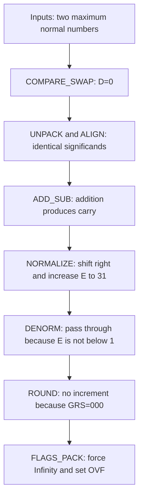
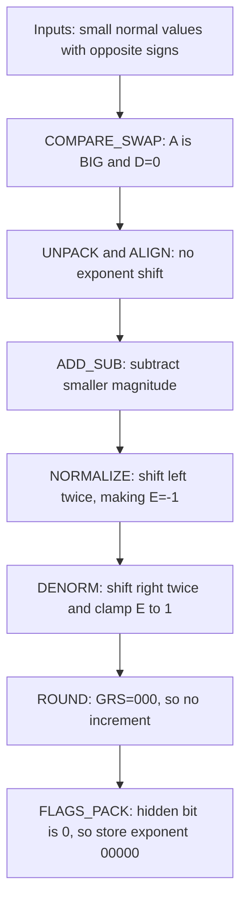

I’ll turn the two newly added output cases—overflow to Infinity and underflow to Subnormal—into stage-by-stage visual traces using the circuit’s actual internal bus widths.

I’m taking “both cases” to mean the two newly implemented behaviors:

1. Overflow → Infinity  
2. Underflow → Subnormal

Remember the 14-bit extended significand format:

```text
EXT[13:3] = 11-bit significand
EXT[2]    = Guard
EXT[1]    = Round
EXT[0]    = Sticky
```

# Case 1: Positive overflow → `+Infinity`

## Test inputs

```text
A = 0 | 11110 | 1111111111     = +65504
B = 0 | 11110 | 1111111111     = +65504
```

Expected:

```text
RESULT = 0 | 11111 | 0000000000
OVF = 1
UNF = 0
```

## Visual circuit flow



## Step 1: `COMPARE_SWAP`

Both numbers have equal magnitudes, so either one can be `BIG`.

```text
BIG   = 0 | 11110 | 1111111111
SMALL = 0 | 11110 | 1111111111

D = E_BIG − E_SMALL
  = 30 − 30
  = 0
```

## Step 2: `UNPACK`

For a normal input, prepend the hidden `1`.

```text
S_BIG   = 0
E_BIG   = 11110 = 30
M_BIG   = 1 | 1111111111
        = 11111111111

S_SMALL = 0
M_SMALL = 11111111111
```

## Step 3: Prepare 14-bit significands

Append three GRS positions:

```text
EXT_BIG = M_BIG << 3
        = 11111111111 | 000
        = 11111111111000
```

Because `D=0`, `ALIGN` performs no shift:

```text
EXT_SMALL = 11111111111000
```

No bits were discarded, so sticky remains zero.

## Step 4: Determine operation

```text
OP = S_BIG XOR S_SMALL
   = 0 XOR 0
   = 0
```

Therefore, `ADD_SUB` selects addition.

## Step 5: Add the significands

The 14-bit values are zero-extended to 15 bits:

```text
   011111111111000
 + 011111111111000
 -----------------
   111111111110000
```

Therefore:

```text
SUM[15] = 111111111110000
```

The leftmost bit is `1`, meaning an addition carry occurred.

## Step 6: `NORMALIZE`

Because there is a carry, shift right once and increment the exponent:

```text
EXT_N = SUM >> 1
      = 11111111111000

E_N = E_BIG + 1
    = 30 + 1
    = 31
    = 0011111 in 7 bits
```

```text
IS_ZERO = 0
```

## Step 7: `DENORM`

DENORM checks:

```text
E_N < 1?
31 < 1? No
```

Therefore, it performs a pass-through:

```text
EXT_D = EXT_N = 11111111111000
E_D   = E_N   = 0011111
```

DENORM is not active during overflow.

## Step 8: `ROUND`

Split the extended value:

```text
EXT_D = 11111111111 | 000
          M[10:0]      GRS
```

Therefore:

```text
M₀ = 11111111111
G  = 0
R  = 0
S  = 0
```

Round-to-nearest-even increment:

```text
INC = G AND (R OR S OR M₀[0])
    = 0
```

So:

```text
M_R = 11111111111
E_R = 31
```

## Step 9: `FLAGS_PACK`

Overflow detection:

```text
LT31  = E_R < 31 = 0
IS_INF = NOT LT31 = 1
```

The new output multiplexers force:

```text
Exponent = 11111
Fraction = 0000000000
```

Even though the raw fraction was nonzero, it is cleared:

```text
F10_RAW = 1111111111
F10     = IS_INF ? 0000000000 : F10_RAW
        = 0000000000
```

Final result:

```text
RESULT = 0 | 11111 | 0000000000
         S   Infinity   fraction
```

Flags:

```text
OVF = 1
UNF = 0
```

This is `+Infinity`, not NaN.

---

# Case 2: Arithmetic underflow → Subnormal

## Test inputs

```text
A = 0 | 00001 | 1000000000
  = +1.5 × 2⁻¹⁴

B = 1 | 00001 | 0100000000
  = −1.25 × 2⁻¹⁴
```

Mathematically:

```text
A + B = (1.5 − 1.25) × 2⁻¹⁴
      = 0.25 × 2⁻¹⁴
      = 2⁻¹⁶
```

Expected:

```text
RESULT = 0 | 00000 | 0100000000
OVF = 0
UNF = 1
```

## Visual circuit flow



## Step 1: `COMPARE_SWAP`

```text
|A| = 1.5 × 2⁻¹⁴
|B| = 1.25 × 2⁻¹⁴
```

Therefore:

```text
BIG   = A
SMALL = B
```

The exponents are equal:

```text
D = 1 − 1 = 0
```

## Step 2: `UNPACK`

For `A`:

```text
S_BIG = 0
E_BIG = 00001 = 1

M_BIG = 1 | 1000000000
      = 11000000000
```

For `B`:

```text
S_SMALL = 1
E_SMALL = 00001 = 1

M_SMALL = 1 | 0100000000
        = 10100000000
```

## Step 3: Prepare and align

Append GRS bits:

```text
EXT_BIG   = 11000000000 | 000
          = 11000000000000

EXT_SMALL = 10100000000 | 000
          = 10100000000000
```

Because `D=0`, no alignment shift is required.

## Step 4: Determine operation

```text
OP = S_BIG XOR S_SMALL
   = 0 XOR 1
   = 1
```

Therefore, subtract:

```text
EXT_BIG − EXT_SMALL
```

## Step 5: Subtract the significands

```text
   011000000000000
 − 010100000000000
 -----------------
   000100000000000
```

Therefore:

```text
SUM[15] = 000100000000000
```

## Step 6: `NORMALIZE`

The result is:

```text
0.25 × 2⁻¹⁴
```

To obtain the internal normalized form, the significand must shift left twice:

```text
Before shift: 00100000000000
After << 1:   01000000000000
After << 2:   10000000000000
```

Each left shift decreases the stored exponent:

```text
E_N = E_BIG − 2
    = 1 − 2
    = −1
```

In 7-bit two’s complement:

```text
E_N = 1111111
```

Normalizer outputs:

```text
EXT_N   = 10000000000000
E_N     = −1
IS_ZERO = 0
```

## Step 7: New `DENORM` operation

DENORM checks:

```text
E_N < 1?
−1 < 1? Yes
```

Calculate the required right-shift:

```text
SHIFT = 1 − E_N
      = 1 − (−1)
      = 2
```

Right-shift:

```text
EXT_N = 10000000000000
                 >> 2
EXT_D = 00100000000000
```

The discarded bits are both zero:

```text
Discarded bits = 00
STICKY = 0
```

DENORM clamps the working exponent:

```text
E_D = 1
    = 0000001
```

So DENORM outputs:

```text
EXT_D = 00100000000000
E_D   = 0000001
```

## Step 8: `ROUND`

Split the extended value:

```text
EXT_D = 00100000000 | 000
          M_R[10:0]    GRS
```

Therefore:

```text
M₀ = 00100000000
G  = 0
R  = 0
S  = 0
```

No rounding increment:

```text
INC = 0
```

Final rounded values:

```text
M_R = 00100000000
E_R = 0000001
```

Notice:

```text
M_R[10] = 0
```

This missing hidden `1` identifies a subnormal result.

## Step 9: `FLAGS_PACK`

Subnormal detection:

```text
SUBN = NOT M_R[10]
     = NOT 0
     = 1
```

The exponent multiplexer forces:

```text
Stored exponent = 00000
```

The hidden position is removed, leaving:

```text
M_R       = 0 | 0100000000
Hidden bit    Fraction
```

Therefore:

```text
Stored fraction = 0100000000
```

Final result:

```text
RESULT = 0 | 00000 | 0100000000
```

Flags:

```text
OVF = 0
UNF = 1
```

## Final comparison

| Signal | Overflow case | Underflow case |
|---|---:|---:|
| `E_N` after normalization | `31` | `−1` |
| DENORM action | Pass through | Shift right by 2 |
| `E_D` | `31` | `1` internally |
| `M_R[10]` | `1` | `0` |
| Stored exponent | `11111` | `00000` |
| Stored fraction | `0000000000` | `0100000000` |
| Output class | `+Infinity` | Positive subnormal |
| `OVF` | `1` | `0` |
| `UNF` | `0` | `1` |


---