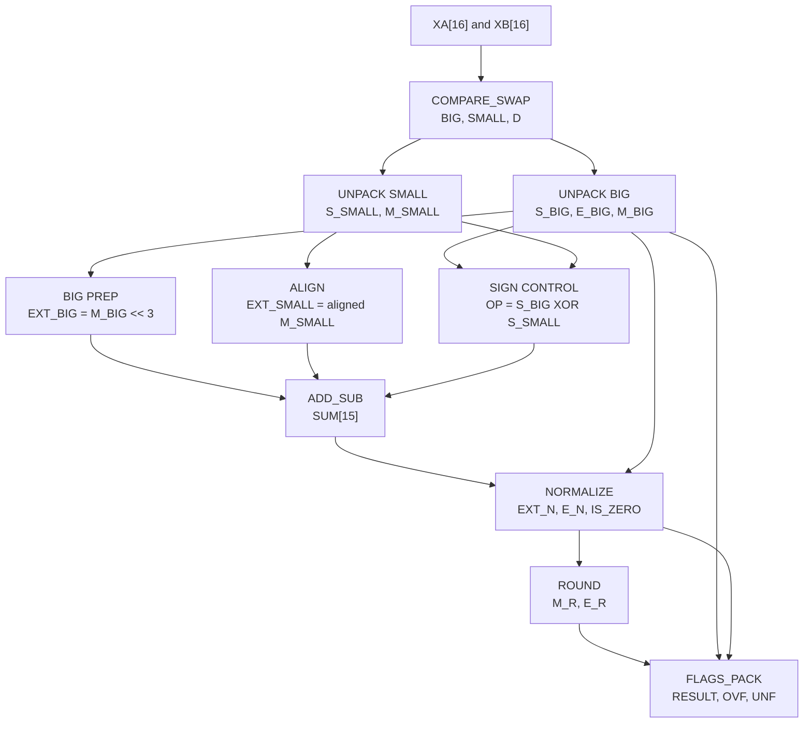

# FP16 Floating-Point Adder in Logisim

A combinational 16-bit floating-point adder designed for the CSE210 Computer Architecture Sessional assignment. The circuit accepts two custom FP16 numbers, adds them, and produces a packed 16-bit result with overflow and underflow flags.

The implementation is divided into reusable Logisim subcircuits for comparison, alignment, arithmetic, normalization, rounding, and result packing.

## Project Files

| File | Purpose |
|---|---|
| `FP16_Adder_Submodules_fixed_169.circ` | Complete Logisim Evolution project. The main circuit is `FPA`. |
| `FP16_Adder_Block_Diagram.docx` | Detailed block diagram, signal widths, module interfaces, and implementation rules. |
| `README.md` | Project documentation and testing instructions. |

## Floating-Point Format

Each number is stored in 16 bits:

```text
Bit 15       Bits 14:10             Bits 9:0
+------+-------------------+--------------------------+
| Sign | Exponent (5 bits) | Fraction (10 bits)       |
+------+-------------------+--------------------------+
```

The represented value is:

```text
(-1)^Sign x (1.Fraction) x 2^(Exponent - 15)
```

- `Sign = 0` means positive and `Sign = 1` means negative.
- The exponent uses a bias of `15`.
- Normalized numbers use an implicit leading `1`.
- The stored fraction contains ten bits.

## Features

- Addition of two normalized FP16 values
- Addition and subtraction based on operand signs
- Magnitude comparison and operand ordering
- Exponent comparison and significand alignment
- Guard, round, and sticky bit preservation
- Round-to-nearest-even
- Carry and cancellation normalization
- Overflow and underflow detection
- Exact-zero detection
- Modular Logisim design with seven reusable subcircuits

## Architecture



## Subcircuits

| Subcircuit | Inputs | Outputs | Responsibility |
|---|---|---|---|
| `UNPACK` | `X[16]` | `S[1]`, `E[5]`, `M[11]` | Separates the packed fields and restores the hidden leading `1`. |
| `COMPARE_SWAP` | `XA[16]`, `XB[16]` | `BIG[16]`, `SMALL[16]`, `D[5]` | Orders the operands by magnitude and calculates the exponent difference. |
| `ALIGN` | `M_SMALL[11]`, `D[5]` | `EXT_SMALL[14]` | Right-shifts the smaller significand and preserves sticky information. |
| `ADD_SUB` | `OP`, `EXT_BIG[14]`, `EXT_SMALL[14]` | `SUM[15]` | Adds equal-sign operands or subtracts the smaller magnitude for different signs. |
| `NORMALIZE` | `SUM[15]`, `E_IN[7]` | `EXT[14]`, `E_OUT[7]`, `IS_ZERO` | Handles carry normalization, cancellation normalization, and exact zero. |
| `ROUND` | `EXT[14]`, `E_IN[7]` | `M[11]`, `E_OUT[7]` | Applies round-to-nearest-even and handles a rounding carry. |
| `FLAGS_PACK` | `S`, `E[7]`, `M[11]`, `IS_ZERO` | `RESULT[16]`, `OVF`, `UNF` | Detects flags and repacks the sign, exponent, and fraction. |

## Important Internal Signals

| Signal | Width | Meaning |
|---|---:|---|
| `XA`, `XB` | 16 | Packed input values |
| `BIG`, `SMALL` | 16 | Operands ordered by magnitude |
| `D` | 5 | Exponent difference |
| `M_BIG`, `M_SMALL` | 11 | Hidden bit plus ten fraction bits |
| `EXT_BIG`, `EXT_SMALL`, `EXT_N` | 14 | Eleven-bit significand plus guard, round, and sticky bits |
| `SUM` | 15 | Raw significand result plus possible carry |
| `E_BIG7`, `E_N`, `E_R` | 7 | Internal signed exponent |
| `OP` | 1 | `0` for addition and `1` for subtraction |
| `IS_ZERO` | 1 | Indicates exact cancellation |
| `RESULT` | 16 | Final packed FP16 output |
| `OVF`, `UNF` | 1 | Overflow and underflow flags |

The 14-bit extended significand is arranged as:

```text
EXT[13:0] = Significand[13:3] | Guard[2] | Round[1] | Sticky[0]
```

## Arithmetic Rules

### Operation selection

```text
OP = S_BIG XOR S_SMALL
```

- `OP = 0`: add the extended significands.
- `OP = 1`: subtract `EXT_SMALL` from `EXT_BIG`.
- The final sign is the sign of the larger-magnitude operand, `S_BIG`.

### Rounding

The circuit uses round-to-nearest-even:

```text
ROUND_UP = G AND (R OR S OR retained_LSB)
```

### Assignment flags

```text
E >= 31  -> OVF = 1
E <= 0   -> UNF = 1
```

The comparisons are performed on the 7-bit signed internal exponent before it is truncated for the packed output.

## Requirements

- Logisim Evolution `4.1.0` is recommended.
- No clock is required; the design is fully combinational.
- Built-in adders, subtractors, comparators, multiplexers, shifters, gates, and bit finders are used.

## Running the Circuit

1. Open Logisim Evolution.
2. Select **File > Open**.
3. Open `FP16_Adder_Submodules_fixed_169.circ`.
4. Select the `FPA` circuit from the circuit explorer.
5. Choose the **Poke Tool**.
6. Enter 16-bit values into `XA` and `XB`. Hexadecimal display is the easiest option.
7. Read the values from `RESULT`, `OVF`, and `UNF`.
8. Open individual subcircuits to inspect intermediate behavior when debugging.

In Logisim, tunnels carrying the same label are electrically connected even when a long wire is not drawn between them.

## Verification Tests

| Test | `XA` | `XB` | Expected result |
|---|---:|---:|---|
| Normal addition: `12.0 + 0.5` | `0x4A00` | `0x3800` | `RESULT = 0x4A40`, `OVF = 0`, `UNF = 0` |
| Carry normalization: `15.0 + 1.0` | `0x4B80` | `0x3C00` | `RESULT = 0x4C00` |
| Rounding: `16.0 + 0.01171875` | `0x4C00` | `0x2200` | `RESULT = 0x4C01` |
| Overflow | `0x7BFF` | `0x7BFF` | `OVF = 1` |
| Underflow by cancellation | `0x2801` | `0xA800` | `UNF = 1` |

### Worked example

```text
XA = 0x4A00 = 0 | 10010 | 1000000000 = 12.0
XB = 0x3800 = 0 | 01110 | 0000000000 = 0.5

E_BIG = 18
E_SMALL = 14
D = 4

M_BIG     = 11000000000
M_SMALL   = 10000000000
EXT_BIG   = 11000000000000
EXT_SMALL = 00001000000000

SUM       = 011001000000000
EXT_N     = 11001000000000
E_N       = 18

RESULT = 0 | 10010 | 1001000000
       = 0x4A40
       = 12.5
```

## Design Notes

- Multiplexer enable pins must be disabled.
- The alignment shift amount is clamped before entering the 14-bit shifter.
- The internal exponent remains 7-bit signed until `FLAGS_PACK`.
- Exact zero forces `RESULT` to zero and suppresses both flags.
- The normalizer uses a bit finder and barrel shifter instead of an iterative loop.
- Rounding overflow is normalized by setting the significand to `1.0` and incrementing the exponent.

## Limitations

- Inputs are assumed to be normalized finite values.
- NaN and infinity are not implemented.
- General subnormal-input handling is not implemented.
- Overflow and underflow behavior follows the assignment specification rather than the complete IEEE 754 standard.
- The design is combinational and is not pipelined.

## Submission Reminder

The assignment submission should include:

1. The Logisim `.circ` project.
2. The block diagram exported to PDF.
3. A report containing the block diagram and one complete step-by-step addition example.

Convert `FP16_Adder_Block_Diagram.docx` to PDF before placing it in the final submission ZIP.

